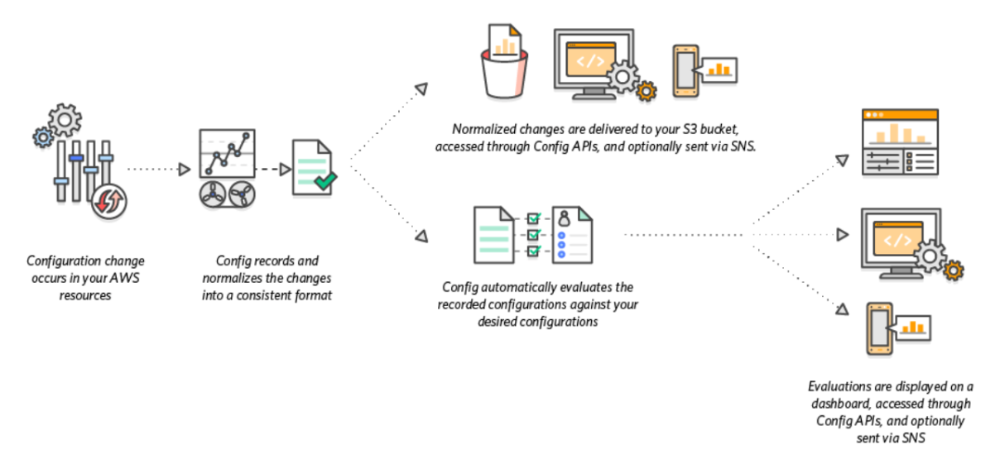

# terraform-aws-config
This module sets up AWS Config and an s3 bucket for historical configuration changes.
Also have the option to setup config on all regions or mutiple regions via the aggregator resource.
With the aggregator resource you also have the ability to setup multi accounts, and even oraganisation wide if you have the persmissions.   
Read more about data aggregation in the [aws docs](https://docs.aws.amazon.com/config/latest/developerguide/aggregate-data.html).



## Provisional Instructions

#### Minimal
```hcl
module "test" {
  source = "git@github.com:playgroundcloud/terraform-aws-config.git?ref=vX.Y.Z"
  s3_bucket_name = "unique-name-of-your-s3-bucket"
}
```

#### With account aggregator
```hcl
module "account_aggregation" {
  source            = "git@github.com:playgroundcloud/terraform-aws-config.git?ref=vX.Y.Z"
  s3_bucket_name    = "unique-name-of-your-s3-bucket"
  create_aggregator = true
  account_aggregation_source = ({
    account_ids = ["123456789101"]
    all_regions = false
    regions     = ["eu-north-1","eu-west-1"]
  })
}

```

#### With organization aggregator
```hcl
module "organization_aggregation" {
  source            = "git@github.com:playgroundcloud/terraform-aws-config.git?ref=vX.Y.Z"
  s3_bucket_name    = "unique-name-of-your-s3-bucket"
  create_aggregator = true
  organisation_aggregation_source = ({
    all_regions = true
    regions     = null
    role_arn    = module.organization_aggregation.aws_config_role_arn
  })
}

```


### Variables:

- `s3_bucket_name` | (Required) - String   
  S3 bucket name to store AWS logs in. 
  
- `versioning` | (Optional) - Bool   
  Enable versioning on s3 bucket.   
  Default: true 

- `config_delivery_frequency` | (Optional) - String   
  How often config will send snapshots to S3 bucket vpc endpoints.     
  Default: "Six_Hours"     
  Valid Values: One_Hour | Three_Hours | Six_Hours | Twelve_Hours | TwentyFour_Hours

- `standard_transition_days` | (Optional) - Number    
  Number of days to persist in the standard storage tier before moving to the infrequent access tier.      
  Default: 30

- `glacier_transition_days` | (Optional) - Number      
  Number of days after which to move the data to the glacier storage tier      
  Default: 60

- `enable_glacier_transition` | (Optional) - Bool      
  Enables the transition to AWS Glacier which can cause unnecessary costs for huge amount of small files      
  Default: true

- `expiration_days` | (Optional) - Number      
  Number of days after which to expunge the objects      
  Default: 90

- `config_name` | (Optional) - string      
  The name of the aws config instance      
  Default: "aws_config"

- `s3_tags` | (Optional) - map(string)      
  Map tags to be used on s3 bucket      
  Default: {}

- `agg_tags` | (Optional) - map(string)      
  Map tags to be used on aggregation resource      
  Default: {}

- `create_aggregator` | (Optional) - Bool      
  Enable this to aggregate with either account or organisation source. If set to true, `account_aggregation_source` or `organization_aggregation_source` must also be set.      
  Default: false

- `account_aggregation_source` | (Optional) - Object  
  - `account_ids` = `list(string)` a list of all account IDs.
  - `all_regions` = `bool` If true, aggregate existing AWS Config regions and future regions. Conficts with regions.
  - `regions` = `list(string)`List of source regions being aggregated. Conficts with `all_regions` 
 
  Object of account sources to aggregate. Either regions or all_regions must be specified.   
  If used, create_aggregator must be set to true.   
  Default: Null  
  [Look at this example](./test/example_account_aggregation/main.tf)
- `organization_aggregation_source` | (Optional) - Object      
   - `all_regions` = `bool` If true, aggregate existing AWS Config regions and future regions. Conficts with regions.
  - `regions` = `list(string)`List of source regions being aggregated. Conficts with `all_regions` 
  - `role_arn` = `string` The role arn with organisation permissions.
  EG "service-role/AWSConfigRoleForOrganizations"
 
      
  Object with the AWS Organization configuration for the Config Aggregator. Either regions or all_regions must be specified.     
  If used, create_aggregator must be set to true.  
  Default: Null    
  [Look at this example](./test/example_organisation_aggregation/main.tf)


### Outputs

- `aws_logs_bucket`
- `aws_config_role_arn`
- `aws_config_role_name`